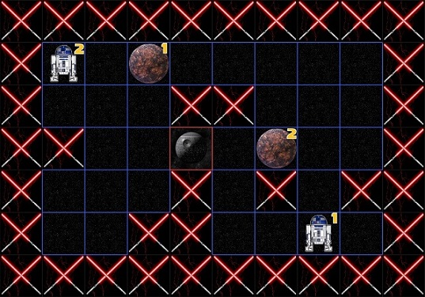
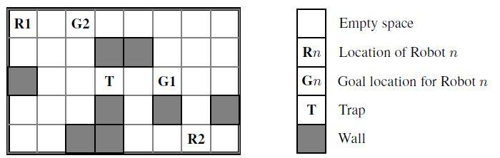

# A star wars

A-star-wars is a Java Artificial Intelligence project using an A* algorithm with a graphic and audio Star Wars theme. See demo [here](https://www.youtube.com/watch?v=HuzCNBXjQ9w). 


### Context 

During our academic exchange in Heriot Watt Univerity in Edinburgh, we have been assigned to design and develop an A* search in order that two agents can find their way in a maze.

## Authors

* **Nicolas Gorrity** - *Initial work* - [GitHub](https://github.com/nicolasgorrity) [LinkedIn](https://www.linkedin.com/in/ngorrity/)
* **Fabien Roussel** - *Initial work* - [GitHub](https://github.com/FabienRoussel) [LinkedIn](https://www.linkedin.com/in/fabien-roussel/)

## Rules and constraints

> Two parcel delivery robots must carry packages from their starting locations to specific delivery locations. Each robot can move independently from the other robot. The area in which the robots operate may contain walls which block their progress. The area may also contain traps which the robots can pass through but at an additional cost. The goal is to find paths for the two robots to move from their starting locations to their assigned delivery locations. *For example*:



Additional details about the scenario:
* The matrix in which the robots move is a grid of N x M cells. Each robot occupies one cell in the grid and cannot move outside the grid. The robots cannot share the same space at the same time.
* A robot can move to any grid space immediately adjacent to it that is not occupied by another robot or a wall. A robot cannot move diagonally, which means it only has 4 possible directions. Robots are permitted to move through traps.
* The cost for moving to an adjacent space that is empty is 1 unit of energy whereas moving to a trap costs 5 units of energy.

To complicate matters further, we have decided to implement an A* search for n robots (with n>0). For more details about our choices of conception and other explanation, please refer to the section `About our A* algorithms`

## Getting Started
### Prerequisites

In this getting started procedure we will use Intellij IDEA.

### Installing

First step begins by cloning the project with :
```
git clone https://github.com/nicolasgorrity/A-star-wars
```

Then select import project and choose your repository where you have downloaded the project. Click five times on the button next and the project will be correctly imported.

If you want to run the project (obviously you want it because you are reading these lines) you will need to download the following .jar:
* lwjgl.jar that you will find at the [address](https://github.com/LWJGL/lwjgl3/releases).
* PNGDecoder.jar that you will find at the [address](https://jar-download.com/artifact-search/pngdecoder).

In order to import these .jar, and by assuming you have placed them in the repository `D:\Users\MyName\Documents\intellij\IntelliJ Additional Libraries\lwjgl-3.0.0\jar\`, you will need to follow theses steps :  
1. Click on `File` from the toolbar
2. Click on `Project Structure` (`CTRL + SHIFT + ALT + S` on Windows/Linux, `⌘` + `;` on Mac OS X)
3. Select `Modules` at the left panel
4. Dependencies tab
5. '+' → JARs or directories
6. Put the path `D:\Users\MyName\Documents\intellij\IntelliJ Additional Libraries\lwjgl-3.0.0\jar`
7. Do not forget to click on apply

You should see the two libraries under the `External Libraries` on the left panel.

You may not be able to build and run the project at this point. If it is the case you need to click on `Edit configuration` on the top right corner. Click on the '+' on the top left corner of the window that have just appeared. Select `Application`. Choose `MainClass` as the main class and add `-Djava.library.path=libs` in the VM options.

Voilà ! You may now take off towards a far far away galaxy by running the project !
Don’t forget to turn on the sound! You’d regret not to... ;)

## How to play
The levels are displayed with an incredible and incomparable Star Wars theme, and played with an amazing John Williams Star Wars music.
* The program can be exit by pressing Escape.
* Even if it's useless, textures can be set back to our first graphics by pressing G. Press G again to restore the Star Wars them (it’s quite better isn’t it?)
* The sound can be muted or unmuted by pressing S (but we don’t want to mute it, do we?)
* Robots can be moved manually before launching the search. To do so, click on the robot you want to move, and it will be highlighted with a white square around it. Once it is selected, you can move it with the keyboard arrows.
* To launch the A* search, press ‘D’ to use the Dijkstra heuristic (best ever!), press ‘M’ or ‘;’ (azerty compatibility...) to use the Manhattan heuristic (much less good!), or press ‘E’ to use the Euclidean heuristic (appears to be the worst heuristic most of the time).
* While it is searching, a great Duel of the Fates theme is played. Once the solution has been found, the diagnosis of the search is displayed onto the console and you can immediately see the robots going through their path on the screen. Listen to that great sound when they all reach their goals!
* After a search, you can manually move the robots and re-launch another search. Otherwise you can press ‘0’, ‘1’, ‘2’ ... until ‘9’ to load one of our ten different levels! By default, the level displayed when you launch the program is level 1. You can see what level you are playing on the title of the window. We invite you to try them all, the more you go, the more the R2D2s are going to get into trouble to avoid the death stars (It's a trap!) and deliver their parcel to Coruscant! ;)

## About our A* algorithms:
The number of robots doesn’t have to always be 2. We can have levels with 1, 2, 3 or as many robots as we want. But increasing the number of robots has a huge impact on the size of the search tree. In the examples of levels that we provide, we tried problems with 2, 3, and even 4 robots, whose solution are almost always found in tenths of second (with Dijkstra! Other heuristics can take few seconds or minutes on hard levels).
Our A* use a custom priority queue. You will find more explanation in the comments of the file RobotPriorityQueue.java

### Heuristics
We implemented three different heuristics: Dijkstra, Manhattan, and Euclide. Explanations can be found in the comments of java classes Heuristic.java, Dijkstra.java, Euclide.java, and Manhattan.java. You will find them in the folder src/search/heuristics

### A* methods
We implemented two different A* methods. Both of them can be found in the file SearchField.java. What differentiates them is the way we create the neighbor nodes from a freshly de-queued node.

#### First A*
In the first A* we developed, the difference between a parent node and a child node was that only one robot at a time could move. So when a robot made one move, the other robots had to stay immobile and wait for their turn. This was still effective. Here is a simplified pseudo-code for the algorithm generating the child nodes for our first A*:
```
For each robot, 
	for each direction available, 
		if this robot can move to this direction, 
			create a child node with the same list of robots as its parent, 
			then update the position of the moved robot. 
			If this node does not exist yet, or if it exists but has a superior previous cost, 
				insert/replace it in the list of visited notes 
				and add it to the priority queue. 
```
This is basically how it works.

#### Second A* 
The second A* works differently. From a parent node to a child node, every robot has moved in any possible direction. To do so, prior to do the A* search, we have to generate a list of every combination of possible moves that robots can do. For example, let's take the example of 2 robots. All the possibilities of moves are:
`UP:UP ; UP:RIGHT ; UP:LEFT ; UP:DOWN ; UP:NONE ; RIGHT:UP ; RIGHT:RIGHT ; RIGHT:LEFT ; RIGHT:DOWN ; RIGHT:NONE ; LEFT:UP ; LEFT:RIGHT ; LEFT:LEFT ; LEFT:DOWN ; LEFT:NONE ; DOWN:UP ; DOWN:RIGHT ; DOWN:LEFT ; DOWN:DOWN ; DOWN:NONE ; NONE:UP ; NONE:RIGHT ; NONE:LEFT ; NONE:DOWN ; NONE:NONE.`

So, from the parent node, the A* will consider every possibility of moves for the robots and, each time that the combination of moves is possible, it will create a child node. This allows generating more child nodes from one single parent node, so the priority queue will be even more effective. This reduces drastically the number of nodes visited. Moreover, this is much more fun to see the robots move together in the same time!

### ZAR: Zone Accessible by Robot
One more interesting thing is the `Zar.java` class, which is a tool we implemented in order to avoid the abusive use of NONE moves in the second A*. In fact, it can happen that the path found for a robot requires it to stay immobile 2 or 3 times, whereas he could have already begun to move.<br />
The principle was removing the possibility of NONE move. But a robot must keep being able to stay immobile, because if a solution requires it to let the priority to another robot, we don’t want it to move around in circles like doing LEFT-RIGHT-LEFT-RIGHT moves, because it would add useless cost to the solution.<br /> 
So we wanted to add the possibility for a robot not to move, ONLY IF its goal was contained in its ZAR, i.e. if there was a path toward its goal with no other robot blocking it.<br />
But this ZAR needs to be calculated for every node, which would probably have required many additional time to find the solution. So we considered that this extra time wasn’t worth the little improvement it could bring: just make the robots move a little bit synchronously.

You will find extra comments in the java file Zar.java, located in `src/search/heuristics`.

### Design your own level
To design you own level, you need to understand that we designed the game only with one coordinate for each element. Indeed if you go in `src/resources/levels` and open one of the files, you'll see something like :
```
11,36
57,13
; 
WWWWWWWWWW
WEEEEEEEEW
WWEWEWEEEW
WEEWTEEEEW
WEEEWWWWEW
WEEEEEEEEW
WWWWWWWWWW
``` 
First you have, on each row, the starting coordinate of the robot and then arrival coordinate the two separated by a comma. After the semicolon you can see the matrix with W for wall, E for space, and T for trap. Here the matrix is 7 by 10 and the first robot starts on cell 11 which means on the row 1 (coordinate // width) and the column 1 (coordinate % width). Its goal is on the cell 36 (row 3, column 6). Now you can design you own level ! 

## License

This project is not under any licensed but please quote us if you are using this project. Furthermore, this project cannot be used for commercial purposes because of the use of graphic and audio from the Star Wars saga.